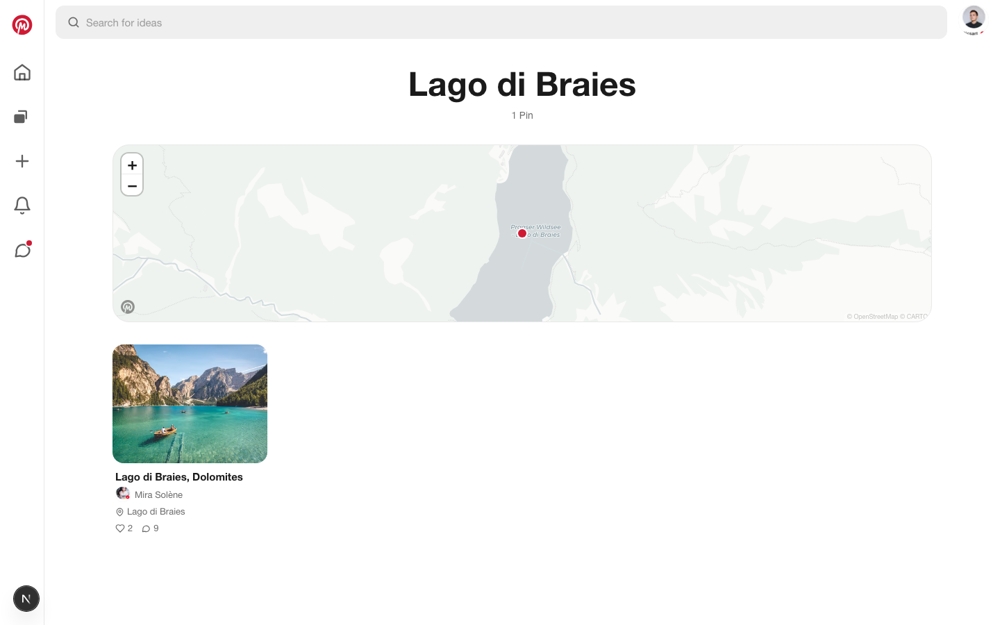
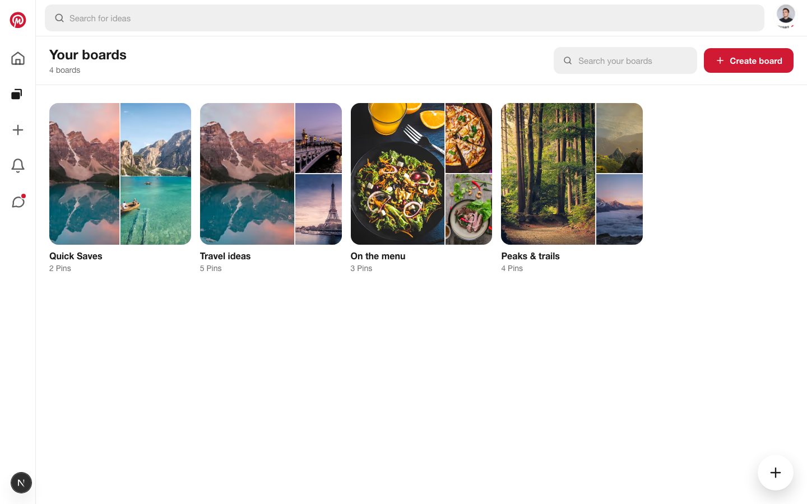
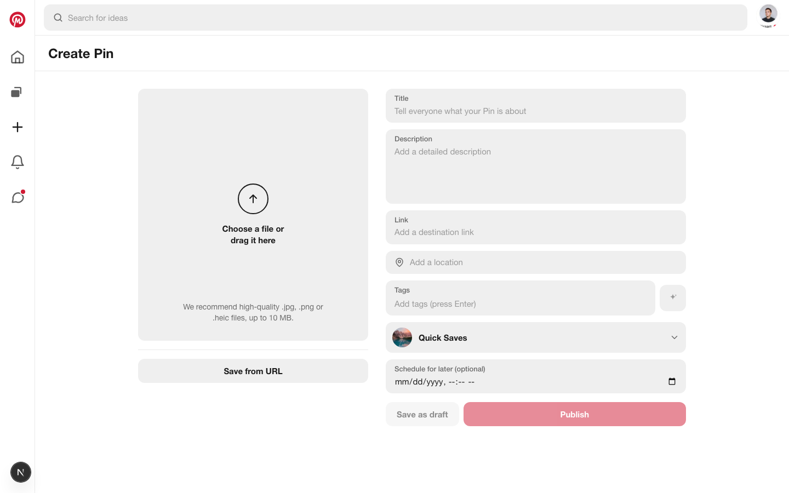
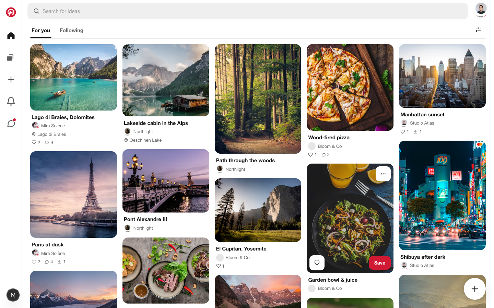
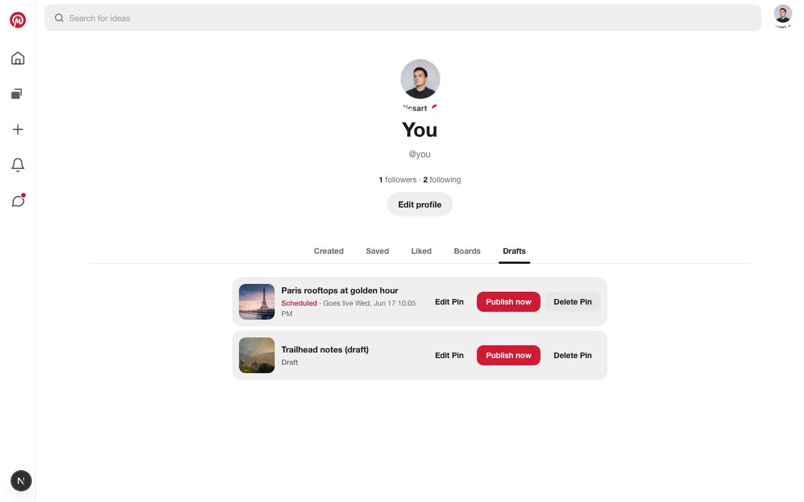

<div align="center">


# Mosaic

A full-stack, Pinterest-style image board: a masonry feed with AI-powered
discovery, pins you can geotag and explore on maps, boards, real-time chat,
drafts &amp; scheduling — wrapped in a Pinterest-grade design system.

<p>
  
  
  
  
  
</p>

</div>


<table>
  <tr>
    <td width="50%"></td>
    <td width="50%"></td>
  </tr>
  <tr>
    <td width="50%"></td>
    <td width="50%"></td>
  </tr>
  <tr>
    <td width="50%"></td>
    <td width="50%"></td>
  </tr>
  <tr>
    <td colspan="2"></td>
  </tr>
</table>

## Contents

- [Features](#features)
- [Tech stack](#tech-stack)
- [Architecture](#architecture)
- [Getting started](#getting-started)
- [Environment variables](#environment-variables)
- [Scripts](#scripts)
- [Testing](#testing)
- [Database](#database)
- [Admin](#admin)
- [Conventions](#conventions)
- [Releases](#releases)
- [Deployment](#deployment)

## Features

- **Pins** — create from an upload or a URL (client-side image compression),
  edit, download and delete, with like, comment and download counters.
- **AI (Mistral)** — automatic **alt-text** and **tag suggestions** from the
  image (Pixtral vision), **semantic search** and **“more like this”** related
  pins via embeddings, behind a provider abstraction.
- **Places & Maps** — geotag a pin with a real place and show it on a minimal
  map (Leaflet + OpenStreetMap/CARTO), a **board map** and a **profile places
  map**, **“near you”** discovery, **search by place**, public **place pages**
  with `Place` structured data, and an **approximate-location** privacy toggle.
- **Drafts & Scheduling** — save pins as **drafts** or **schedule** them to
  publish later from a management tab; scheduled pins go live automatically.
- **Boards** — full CRUD, a default Quick Saves board, save-to-board, secret
  boards, **multi-user collaboration** with roles, and **follow a board**.
- **Real-time messaging** — direct and group conversations with live delivery,
  typing and presence over a dedicated Socket.IO service, message requests, and
  an inbox that slides in over the feed.
- **Comments** — threaded replies, emoji reactions and `@mentions`.
- **Social** — follow creators, **private accounts** with follow requests,
  **block &amp; report**, a notifications inbox/panel (realtime + **web push**)
  and follower counts.
- **Discovery** — a masonry home feed with For You / Following tabs, engagement
  sorting and infinite scroll, interest-based **onboarding**, and search.
- **Creator analytics** — a dashboard of views, saves, likes and downloads with
  a daily views trend.
- **Settings hub** — profile, account (re-authenticated email/password changes),
  notification preferences, privacy and interests.
- **Internationalization** — English and French with locale-aware dates and
  automatic detection.
- **Pinterest-style UI** — a full-height left rail with sliding messages and
  notifications panels on desktop, a mobile bottom bar, a cohesive rounded
  design system, and GSAP motion that respects `prefers-reduced-motion`.
- **Admin** — a `/admin` back office (role-gated) to moderate pins, comments,
  reports and categories.
- **PWA, SEO &amp; a11y** — installable with an offline fallback, a sitemap and
  JSON-LD, WCAG-minded contrast/focus handling verified with automated axe
  checks.

## Tech stack

| Concern   | Choice                                                  |
| --------- | ------------------------------------------------------- |
| Framework | Next.js (App Router) + React                            |
| Language  | TypeScript (`strict`)                                   |
| Styling   | Tailwind CSS + design tokens                            |
| Animation | GSAP (`@gsap/react`)                                    |
| Realtime  | Socket.IO (dedicated service, Redis-adapter ready)      |
| Database  | PostgreSQL + Prisma                                     |
| Auth      | Auth.js (NextAuth) — credentials + Google               |
| AI        | Mistral (Pixtral vision + `mistral-embed` embeddings)   |
| Maps      | Leaflet + OpenStreetMap/CARTO tiles, Nominatim geocoder |
| Push      | Web Push (VAPID) + a service worker                     |
| Storage   | Supabase Storage (uploaded images)                      |
| Analytics | Umami (optional)                                        |
| Testing   | Vitest + Testing Library, Playwright (e2e + a11y)       |
| CI/CD     | GitHub Actions + Docker deploy, release-please releases |

## Architecture

Mosaic is a Next.js App Router app paired with a small standalone Socket.IO
service for realtime.

```text
src/
├─ app/                 # App Router routes
│  ├─ (main)/           # authenticated shell: feed, boards, create, messages,
│  │                    # notifications, pin, search, settings, u/ (profiles)
│  │                    # + @modal parallel route (pin detail overlay)
│  └─ ...               # auth routes, /admin back office, icon & metadata
├─ components/          # UI grouped by feature
│  ├─ ui/               # design-system primitives (Button, Input, Menu, …)
│  └─ layout, feed, pin, board, detail, messages, notifications,
│     profile, create, search, location, auth, admin, engagement, seo
├─ server/              # server-only data layer
│  ├─ services/         # reads (queries)
│  └─ actions/          # mutations (Server Actions)
├─ lib/                 # framework glue: prisma, auth, env, storage, realtime,
│                       # ai (Mistral), geo (haversine), image helpers
├─ icons/               # SVG glyph set + brand logo
├─ hooks/  types/  styles/  generated/   # hooks, domain types, Tailwind, Prisma client
realtime/               # dedicated Socket.IO service (JWT handshake, rooms,
                        # message/typing/presence events) — Redis-adapter ready
prisma/                 # schema, migrations and the development seed
tests/e2e/              # Playwright end-to-end + accessibility specs
```

Reads go through `services`, mutations through Server Actions in `actions`. The
client subscribes to the realtime service for live messages, typing and
presence; everything else is server-rendered. AI features (alt-text, tags,
embeddings) sit behind a provider abstraction over Mistral; geocoding uses
Nominatim and maps use Leaflet. A single shared visibility filter keeps drafts
and not-yet-due scheduled pins out of every public surface, so scheduled pins go
live on their own with no cron.

## Getting started

### Prerequisites

- Node.js 20+
- Docker (for PostgreSQL) — or a Postgres instance of your own

### Setup

```bash
npm install
cp .env.example .env        # then fill in the secrets (see below)
npm run db:up               # start PostgreSQL (docker compose)
npm run db:migrate          # apply the schema
npm run db:seed             # seed demo content (development only)
```

### Run

```bash
npm run dev:all             # Next.js + the realtime service together
# …or run them separately:
npm run dev                 # Next.js          → http://localhost:3000
npm run dev:realtime        # Socket.IO service (live messages/typing/presence)
```

Sign in to the seeded demo account with `demo@mosaic.app` / `password123`.

> The seed is a **development-only** demo dataset and refuses to run when
> `NODE_ENV=production`. Production deployments apply migrations only
> (`prisma migrate deploy`); they are never seeded.

## Environment variables

Copy `.env.example` to `.env` and fill in:

| Variable                                                                 | Purpose                                                                    |
| ------------------------------------------------------------------------ | -------------------------------------------------------------------------- |
| `DATABASE_URL`                                                           | PostgreSQL connection string                                               |
| `POSTGRES_USER` · `POSTGRES_PASSWORD` · `POSTGRES_DB` · `POSTGRES_PORT`  | Credentials for the bundled docker-compose Postgres                        |
| `AUTH_SECRET`                                                            | Auth.js session/JWT secret (`openssl rand -base64 32`)                     |
| `AUTH_URL`                                                               | Canonical app URL used for Auth.js callbacks                               |
| `GOOGLE_CLIENT_ID` · `GOOGLE_CLIENT_SECRET`                              | Google OAuth (optional sign-in provider)                                   |
| `STORAGE_DRIVER`                                                         | Image storage backend (`supabase` or local)                                |
| `SUPABASE_URL` · `SUPABASE_SERVICE_ROLE_KEY` · `SUPABASE_STORAGE_BUCKET` | Supabase Storage for uploaded images                                       |
| `NEXT_PUBLIC_APP_URL`                                                    | Public base URL of the app                                                 |
| `NEXT_PUBLIC_REALTIME_URL`                                               | URL of the realtime service (defaults to same-origin if unset)             |
| `MISTRAL_API_KEY`                                                        | Mistral API key — enables AI alt-text, tags and semantic search (optional) |
| `VAPID_PUBLIC_KEY` · `VAPID_PRIVATE_KEY` · `VAPID_SUBJECT`               | Web Push (VAPID) keys for push notifications (optional)                    |
| `UMAMI_SRC` · `UMAMI_WEBSITE_ID`                                         | Umami analytics (optional)                                                 |

## Scripts

| Script                  | Purpose                                       |
| ----------------------- | --------------------------------------------- |
| `npm run dev`           | Start the Next.js dev server                  |
| `npm run dev:realtime`  | Start the realtime (Socket.IO) service        |
| `npm run dev:all`       | Run the app and the realtime service together |
| `npm run build`         | Production build                              |
| `npm start`             | Start the production server                   |
| `npm run lint`          | ESLint                                        |
| `npm run typecheck`     | TypeScript, no emit                           |
| `npm run format`        | Prettier (write)                              |
| `npm test`              | Unit tests (Vitest)                           |
| `npm run test:watch`    | Unit tests in watch mode                      |
| `npm run test:coverage` | Unit tests with coverage                      |
| `npm run test:e2e`      | End-to-end + a11y tests (Playwright)          |
| `npm run screenshots`   | Regenerate the README screenshots (seeded DB) |
| `npm run db:up`         | Start PostgreSQL (docker compose)             |
| `npm run db:migrate`    | Create/apply migrations (dev)                 |
| `npm run db:seed`       | Seed demo content (dev only)                  |
| `npm run db:studio`     | Open Prisma Studio                            |

## Testing

- **Unit** — `npm test` (Vitest + Testing Library); watch with `npm run test:watch`
  and measure coverage with `npm run test:coverage`.
- **End-to-end & accessibility** — `npm run test:e2e` (Playwright). The config
  boots the dev server and the specs run axe accessibility checks on the key
  routes alongside the user flows.

## Database

PostgreSQL with Prisma. Common tasks:

- `npm run db:migrate` — create and apply a migration in development.
- `npm run db:seed` — load the demo dataset (development only).
- `npm run db:studio` — browse and edit data in Prisma Studio.
- Production applies migrations only with `prisma migrate deploy`; it is never
  seeded.

## Admin

The back office lives at `/admin` and is gated on the `ADMIN` role.

- In development the seed creates an admin account: `admin@mosaic.app` / `password123`.
- In production (never seeded) promote a user with Prisma Studio (`npm run db:studio`)
  by setting their `role` to `ADMIN`, or via SQL:
  `UPDATE "User" SET role = 'ADMIN' WHERE email = 'you@example.com';`

## Conventions

- **TypeScript strict** throughout.
- **JSDoc-only** documentation, in English — no inline `//` or block comments.
- **Design-system first**: reusable components configured through props.
- **Conventional Commits** (Angular style); one branch and PR per change.

## Releases

Versioning is automated with [release-please](https://github.com/googleapis/release-please).
Each `feat`/`fix` merged to `main` updates a release PR that bumps the version
and the [`CHANGELOG.md`](CHANGELOG.md); merging it tags the release and the CD
pipeline deploys it.

## Deployment

The app ships as a standalone Docker image. `docker-compose.prod.yml` runs
PostgreSQL, a one-off migration step (`prisma migrate deploy`), the Next.js app
and the realtime service. GitHub Actions builds and deploys to the host on every
push to `main`.
