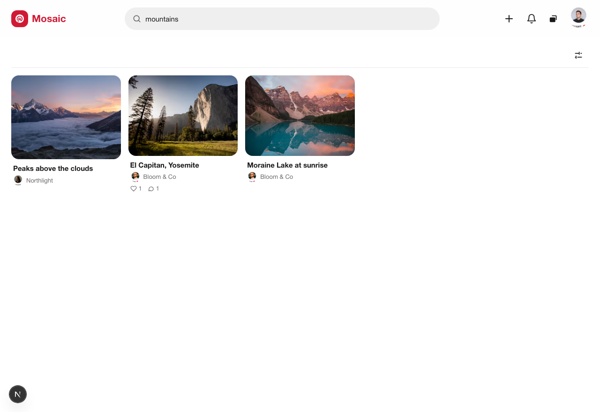
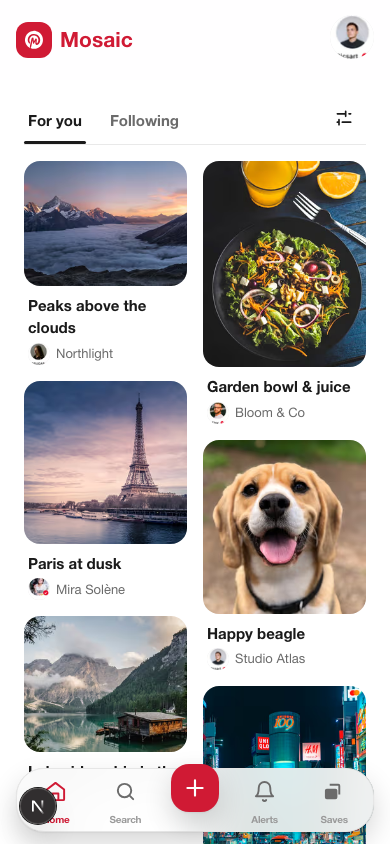

<div align="center">

# Mosaic

A Pinterest-style image board — discover pins, save ideas into boards, follow
creators, comment and publish your own content.

</div>


<table>
  <tr>
    <td width="50%"></td>
    <td width="50%"></td>
  </tr>
</table>

## Features

- **Pins** — create (with client-side image compression), view, download and
  delete, with like, comment and download counters.
- **Boards** — full CRUD, a default Quick Saves board, save-to-board and
  multi-user collaboration.
- **Social** — follow creators, a notifications inbox and follower counts.
- **Discovery** — a masonry home feed with For You / Following tabs, engagement
  sorting and infinite scroll, plus search with sorting.
- **Responsive** — a desktop top bar and a dedicated mobile bottom navigation.
- **Accessible & animated** — WCAG-minded contrast and focus handling, GSAP
  motion that respects `prefers-reduced-motion`.

## Tech stack

| Concern   | Choice                                                  |
| --------- | ------------------------------------------------------- |
| Framework | Next.js (App Router) + React                            |
| Language  | TypeScript (`strict`)                                   |
| Styling   | Tailwind CSS + design tokens                            |
| Animation | GSAP (`@gsap/react`)                                    |
| Database  | PostgreSQL + Prisma                                     |
| Auth      | Auth.js (NextAuth) — credentials + Google               |
| Storage   | Supabase Storage (uploaded images)                      |
| Analytics | Umami (optional)                                        |
| Testing   | Vitest + Testing Library, Playwright (e2e + a11y)       |
| CI/CD     | GitHub Actions + Docker deploy, release-please releases |

## Getting started

```bash
npm install
docker compose up -d        # start PostgreSQL
cp .env.example .env        # then fill in the secrets
npx prisma migrate dev      # apply the schema
npm run db:seed             # seed demo content (development only)
npm run dev                 # http://localhost:3000
```

Sign in to the seeded demo account with `demo@mosaic.app` / `password123`.

> The seed is a **development-only** demo dataset and refuses to run when
> `NODE_ENV=production`. Production deployments apply migrations only
> (`prisma migrate deploy`); they are never seeded.



## Scripts

| Script               | Purpose                       |
| -------------------- | ----------------------------- |
| `npm run dev`        | Start the dev server          |
| `npm run build`      | Production build              |
| `npm run lint`       | ESLint                        |
| `npm run typecheck`  | TypeScript, no emit           |
| `npm test`           | Unit tests (Vitest)           |
| `npm run test:e2e`   | End-to-end tests (Playwright) |
| `npm run db:migrate` | Apply migrations (dev)        |
| `npm run db:seed`    | Seed demo content             |
| `npm run db:studio`  | Open Prisma Studio            |

## Conventions

- **TypeScript strict** throughout.
- **JSDoc-only** documentation, in English — no inline `//` or block comments.
- **Design-system first**: reusable components configured through props.
- **Conventional Commits** (Angular style); one branch and PR per change.

## Releases

Versioning is automated with [release-please](https://github.com/googleapis/release-please).
Each `feat`/`fix` merged to `main` updates a release PR that bumps the version
and the [`CHANGELOG.md`](CHANGELOG.md); merging it tags the release and the CD
pipeline deploys it.

## Deployment

The app ships as a standalone Docker image. `docker-compose.prod.yml` runs
PostgreSQL, a one-off migration step (`prisma migrate deploy`) and the app.
GitHub Actions builds and deploys to the host on every push to `main`.
